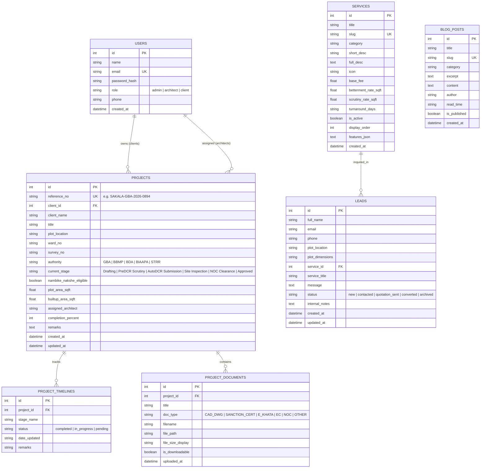

# Database Schema Documentation

## Bengaluru Building Plan Sanction & Architectural Liaisoning System

This system uses a normalized relational schema (SQLite default with PostgreSQL / MySQL compatibility via SQLAlchemy ORM).

### Table Definitions & Indices

1. **`users`**
   - Stores credential hashes using Werkzeug PBKDF2/SHA-256.
   - Roles: `admin` (access to CRM & CMS), `architect` (can update project stages), `client` (can view their Sakala applications).
   - Index on `email`.

2. **`services`**
   - Editable via Admin CMS. Controls public pricing, scrutiny rates, and betterment estimation multipliers.
   - Index on `slug`, `is_active`, `display_order`.

3. **`leads`**
   - CRM records captured via consultation booking forms and contact widgets.
   - Status transitions: `new` -> `contacted` -> `quotation_sent` -> `converted`.

4. **`projects`**
   - Core municipal application entity. Represents an active file undergoing Karnataka Sakala / EoDB-OBPS scrutiny.
   - `reference_no`: Unique statutory reference format `SAKALA-[AUTHORITY]-[YEAR]-[ID]`.

5. **`project_timelines`**
   - Step-by-step audit milestones: Drafting, PreDCR Scrutiny, AutoDCR Submission, Site Inspection, NOC Clearance, Approved.

6. **`project_documents`**
   - Secure downloadable storage for PreDCR CAD drawings (.dxf / .dwg), digital sanction orders, e-Khata extract copies, and municipal NOCs.
